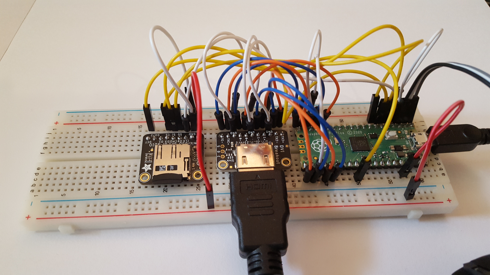
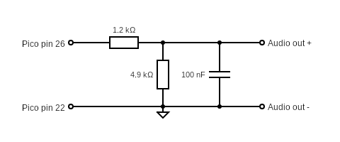
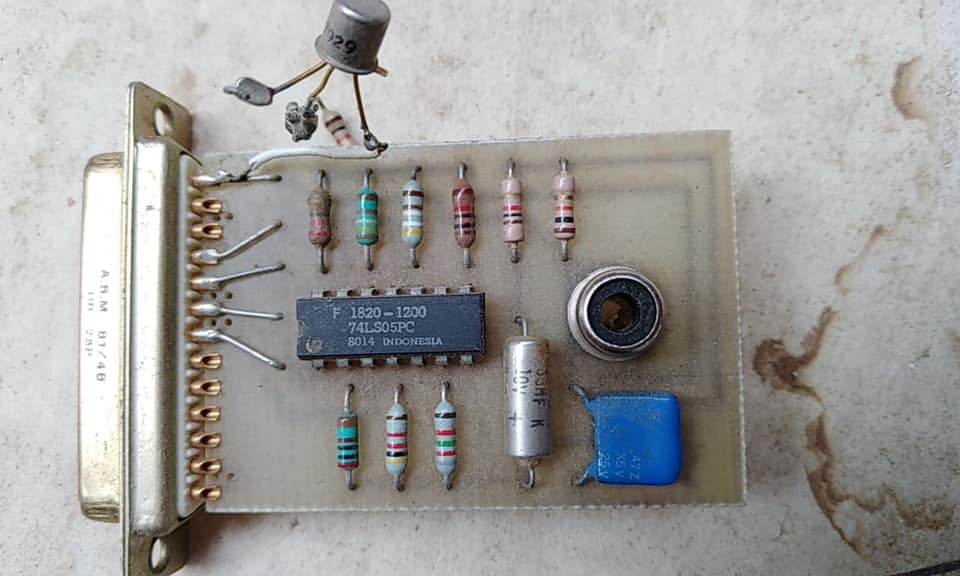
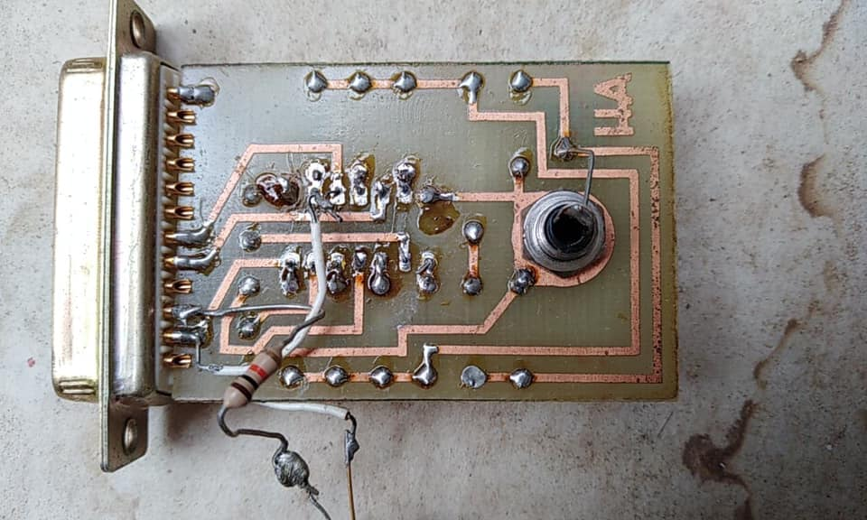
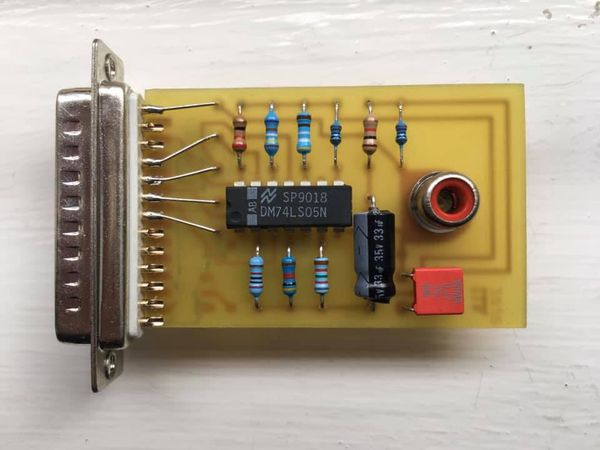
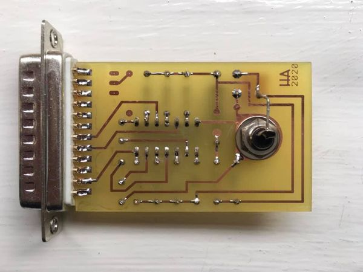

# pico-sorcerer-2
Exidy Sorcerer for Raspberry Pi Pico RP2040 

<a href="http://oldcomputers.net/sorcerer.html">

</a>

## Features
* CP/M 1.4
* DVI over HDMI output<br/>
* 4 emulated disk units with read/write to SD card
* 2 eumlated tape units with read from SD card
* USB Keyboard input
* PWM audio out

## Prototype


## Wiring

|       | SPI0  | GPIO  | Pin   | SPI       | MicroSD 0 | HDMI/DVI  |      Description       | 
| ----- | ----  | ----- | ---   | --------  | --------- | --------- | ---------------------- |
| MISO  | RX    | 4     | 6     | DO        | DO        |           | Master In, Slave Out   |
| CS0   | CSn   | 5     | 7     | SS or CS  | CS        |           | Slave (or Chip) Select |
| SCK   | SCK   | 2     | 4     | SCLK      | CLK       |           | SPI clock              |
| MOSI  | TX    | 3     | 5     | DI        | DI        |           | Master Out, Slave In   |
| CD    |       | 22    | 29    |           | CD        |           | Card Detect            |
| GND   |       |       | 3     |           | GND       |           | Ground                 |
| 3v3   |       |       | 36    |           | 3v3       |           | 3.3 volt power         |
| GND   |       |       | 18,23 |           |           | GND       | Ground                 |
| GP16  |       | 16    | 21    |           |           | TX2+      | Data channel 2+        |
| GP17  |       | 17    | 22    |           |           | TX2-      | Data channel 2-        |
| GP18  |       | 18    | 24    |           |           | TX1+      | Data channel 1+        |
| GP19  |       | 19    | 25    |           |           | TX1-      | Data channel 1-        |
| GP12  |       | 12    | 16    |           |           | TX0+      | Data channel 0+        |
| GP13  |       | 13    | 17    |           |           | TX0-      | Data channel 0-        |
| GP14  |       | 14    | 19    |           |           | TXC+      | Clock +                |
| GP15  |       | 15    | 20    |           |           | TXC-      | Clock -                |
| GP20  |       | 20    | 26    |           |           |           | PWM audio out          |


### Audio filter
It's a good idea to filter out high frequencies from the PWM audio output.
The following components were chosen as I found them in a draw... but it sounds ok.



## Components 
<a href="https://shop.pimoroni.com/products/raspberry-pi-pico">

</a>

<a href="https://buyzero.de/products/raspberry-pi-pico-dvi-sock-videoausgabe-fur-den-pico">

</a>

<a href="https://thepihut.com/products/adafruit-dvi-breakout-board-for-hdmi-source-devices">

</a>

<a href="https://thepihut.com/products/adafruit-micro-sd-spi-or-sdio-card-breakout-board-3v-only">

</a>
                                                                                                        
## Issues
USB host mode required for keyboard input still seems to need a [patch to the Pico SDK](https://github.com/raspberrypi/tinyusb/pull/7/files) version of TinyUSB. The patch seems to work very reliably unless the keyboard is removed and reconnected, which causes the Pico to 'panic'.

This allows usb reconnect: <br/>
https://github.com/hathach/tinyusb/pull/1193/files<br/>

## Build
The latest version of [TinyUSB](https://github.com/hathach/tinyusb) contains some useful patches,
in particular it allows the keyboard to be reconnected.
It is probably a good idea to update the version in [Pico SDK](https://github.com/raspberrypi/pico-sdk) to the latest.
```sh
cd $PICO_SDK_PATH/lib/tinyusb/
git checkout master
git pull
```

This code needs to be cloned into the 'apps' folder of the [PicoDVI](https://github.com/Wren6991/PicoDVI) library. 
```
cd PicoDVI/software/apps
git clone git@github.com:fruit-bat/pico-sorcerer-2.git sorcerer2
git clone git@github.com:fruit-bat/no-OS-FatFS-SD-SPI-RPi-Pico.git
```

In the 'apps' folder add the following lines to CMakeLists.txt
```
add_subdirectory(sorcerer2)
add_subdirectory(no-OS-FatFS-SD-SPI-RPi-Pico/FatFs_SPI)
```
In the build folder:
```
cmake -DPICO_COPY_TO_RAM=0 ..
make -j4 sorcerer2
cp apps/sorcerer2/sorcerer2.uf2 /media/pi/RPI-RP2/
```
### Prepare an SD card
Copy the contents of [SD card](sdcard/) onto a card.

There is more information about which card to choose on [CarlK's no OS FAT FS for Pico](https://github.com/carlk3/no-OS-FatFS-SD-SPI-RPi-Pico) pages.

## Special keys

| Key | Action |
| --- | ------ |
| F1 | Menu system |
| F2 | Copy #0100-#8100 to side buffer |
| F3 | Copy side buffer to #0100-#8100 |
| F4 | Toggle Z80 4Mhz moderator |
| F5 | Repeat |
| F6 | ? |
| F7 | ? |
| F8 | ? |
| F9 | Run stop |
| F11 + F12 | Reset |

## Missing features
* Write 'tape' format
* Read/Write WAV files
* Audio input
* Audio Output
* Centronics interface
* Serial interface (Uart 0 is currently used for debug) 

## Debug
```sh
tio -m ODELBS /dev/ttyUSB0
```
## Resources
### Sound card
The Sorcerer had a [sound card](https://sw-ke.facebook.com/groups/AusVintage/permalink/1188402214859386/) that plugged into the parallel port. It appears to be a single DAC, using the six most significant bits from the port.






### Websites
  [Magnetic font by DamienG](https://damieng.com/typography/zx-origins/)<br/>
  [Exidy Sorcerer Software Library](https://www.classic-computers.org.nz/blog/2017-01-23-software-for-real-sorcerers.htm)<br/>
  [Trailing Edge - Exidy Sorcerer monitor commands](http://www.trailingedge.com/exidy/exidymon.html)<br/>
  [Wren's Amazing PicoDVI](https://github.com/Wren6991/PicoDVI)<br/>
  [CarlK's Super no OS FAT FS for Pico](https://github.com/carlk3/no-OS-FatFS-SD-SPI-RPi-Pico)<br/>
  [Z88dk example for Sorcerer](https://github.com/z88dk/z88dk/wiki/Platform---Sorcerer)<br/>
  [FAT FS Documentation](http://www.elm-chan.org/fsw/ff/00index_e.html)<br/>
  [USB HID Keycodes](https://gist.github.com/MightyPork/6da26e382a7ad91b5496ee55fdc73db2)<br/>
  [4 Voice sound](https://sw-ke.facebook.com/groups/AusVintage/permalink/1188402214859386/)<br/>
  
  
  
