# pico-sorcerer-2
Exidy Sorcerer for Raspberry Pi Pico RP2040 

<a href="http://oldcomputers.net/sorcerer.html">

</a>

## Features
* CP/M 1.4
* DVI over HDMI ([Wren's Amazing PicoDVI](https://github.com/Wren6991/PicoDVI))
* RGB 332 222 & 1111 over VGA<br/>
* 4 emulated disk units with read/write to SD card
* 2 eumlated tape units with read/write to SD card
* ROM Pac read from SD card
* USB Keyboard
* PS/2 keyboard
* PWM/I2S DAC audio out
* On screen menu system

## Supported Boards
* Breadboard
* [RetroVGA](https://hackaday.io/project/183398-retrovga-raspbery-pico-multi-retro-computer)
* Pimoroni Pico DV Demo Base 

<a></a>
<a href="https://hackaday.io/project/183398-retrovga-raspbery-pico-multi-retro-computer"></a>
<a href="https://shop.pimoroni.com/products/pimoroni-pico-dv-demo-base">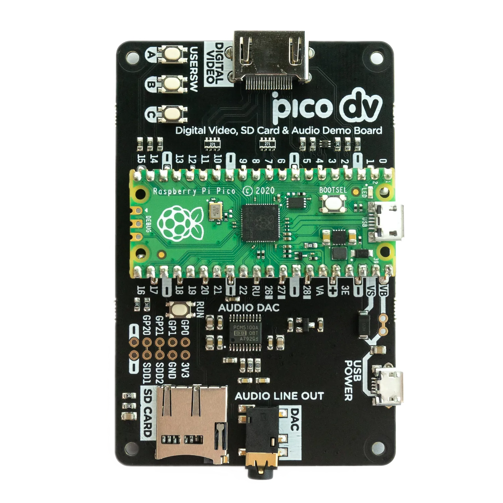</a>

Currently, only the USB keyboard is working on the RetroVGA.

## Updates
* 22/11/22 - Moved to the [Redcode Z80 emulator](https://github.com/redcode/Z80)
* 23/07/22 - Added target for Pico DV board
* 23/07/22 - Moved to Pimoroni FATFS to support Pimoroni Pico DV board
* 23/07/22 - Added support for PS/2 keyboard on HDMI breadboard target
* 06/07/22 - Added support for RGB332, RGB222 and RGBY1111 over VGA

The move from [Carl's no-OS-FatFS-SD-SPI-RPi-Pico](https://github.com/carlk3/no-OS-FatFS-SD-SPI-RPi-Pico) to 
[Pimoroni's FatFS](https://github.com/pimoroni/pimoroni-pico) was made as the SD card pins on the 
[Pimoroni Pico DV Demo Base](https://shop.pimoroni.com/products/pimoroni-pico-dv-demo-base) do not match up with the
RP2040 SPI harware support. The Pimoroni library has a PIO SPI driver, which gets around the problem.


## Screen shots
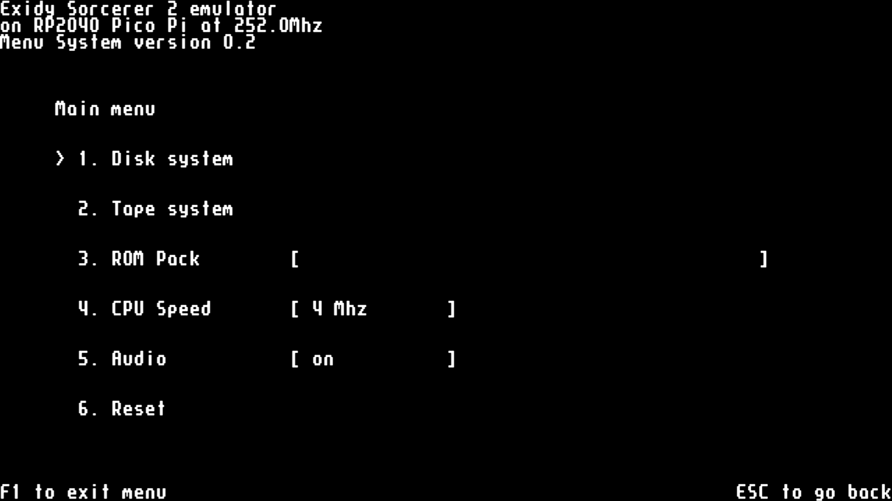  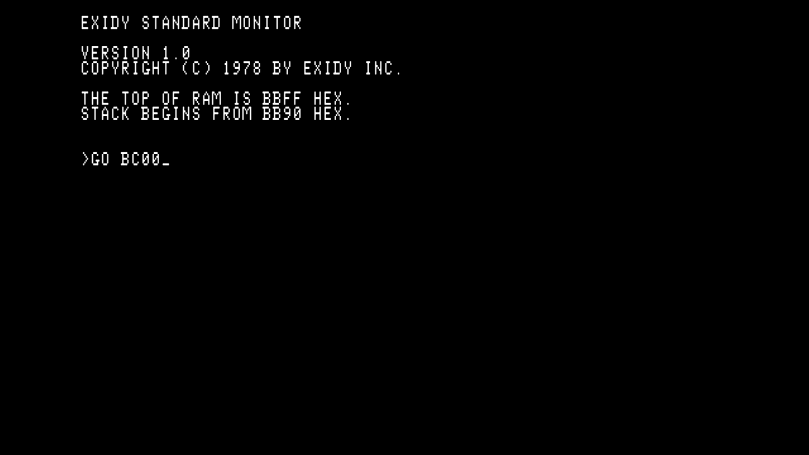  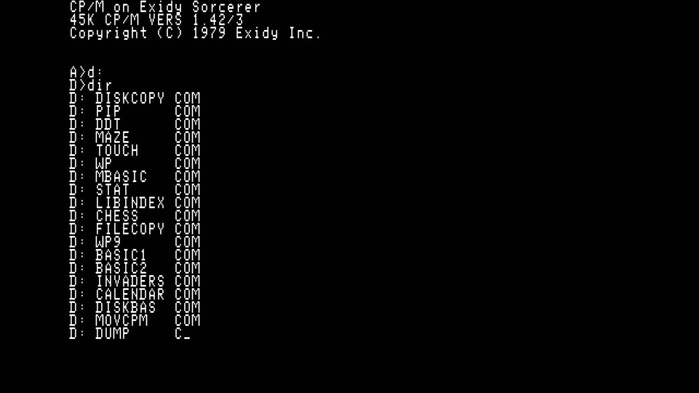  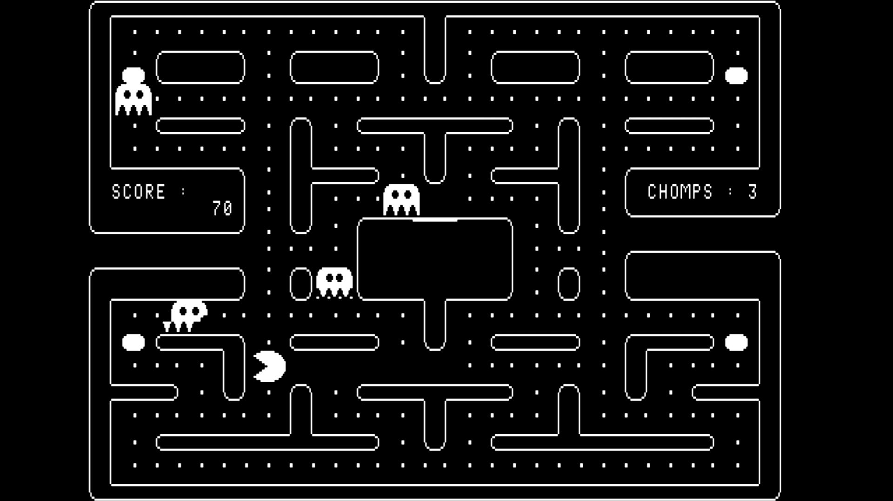 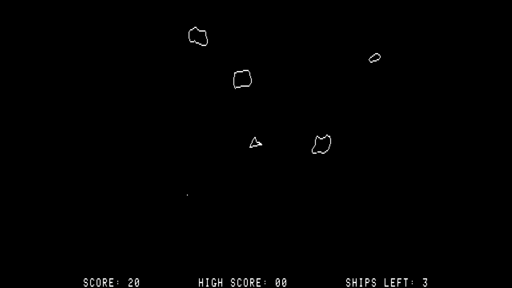 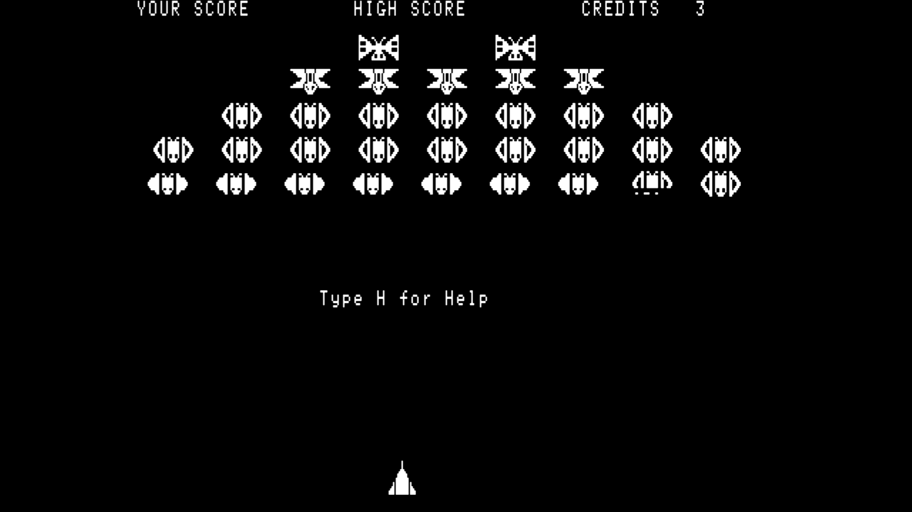 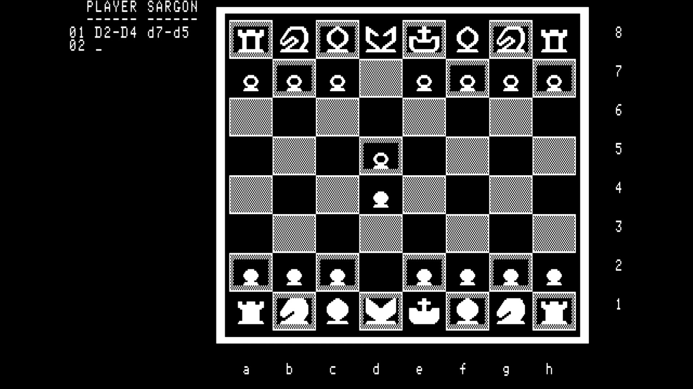 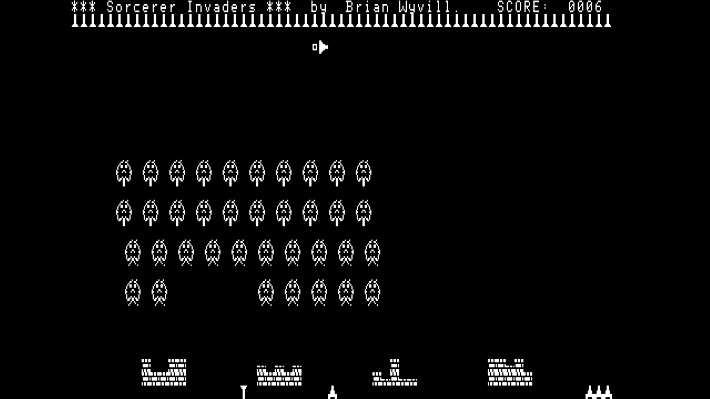 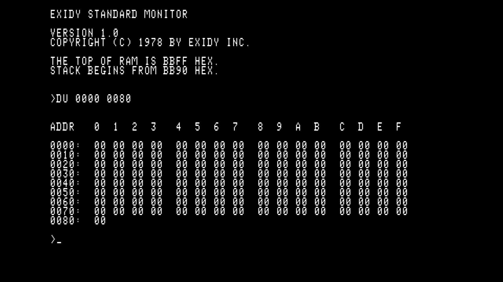 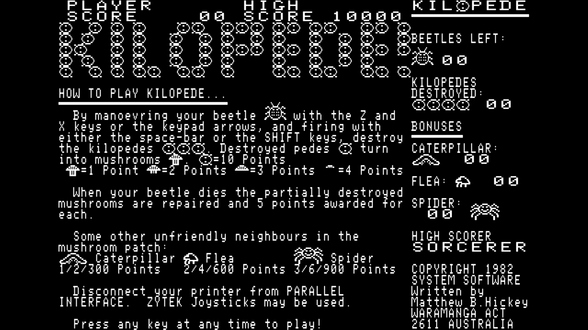


## Prototype


## Wiring

|       | SPI0  | GPIO  | Pin   | SPI       | MicroSD 0 | HDMI/DVI  |      Description       | 
| ----- | ----  | ----- | ---   | --------  | --------- | --------- | ---------------------- |
| MISO  | RX    | 4     | 6     | DO        | DO        |           | Master In, Slave Out   |
| CS0   | CSn   | 5     | 7     | SS or CS  | CS        |           | Slave (or Chip) Select |
| SCK   | SCK   | 2     | 4     | SCLK      | CLK       |           | SPI clock              |
| MOSI  | TX    | 3     | 5     | DI        | DI        |           | Master Out, Slave In   |
| CD    |       | 22    | 29    |           | CD        |           | Card Detect            |
| GND   |       |       | 3     |           | GND       |           | Ground                 |
| 3v3   |       |       | 36    |           | 3v3       |           | 3.3 volt power         |
| GND   |       |       | 18,23 |           |           | GND       | Ground                 |
| GP16  |       | 16    | 21    |           |           | TX2+      | Data channel 2+        |
| GP17  |       | 17    | 22    |           |           | TX2-      | Data channel 2-        |
| GP18  |       | 18    | 24    |           |           | TX1+      | Data channel 1+        |
| GP19  |       | 19    | 25    |           |           | TX1-      | Data channel 1-        |
| GP12  |       | 12    | 16    |           |           | TX0+      | Data channel 0+        |
| GP13  |       | 13    | 17    |           |           | TX0-      | Data channel 0-        |
| GP14  |       | 14    | 19    |           |           | TXC+      | Clock +                |
| GP15  |       | 15    | 20    |           |           | TXC-      | Clock -                |
| GP20  |       | 20    | 26    |           |           |           | PWM audio out          |
| GP6   |       | 6     | 9     |           |           |           | PS/2 data (RP_PS2_DATA)|
| GP7   |       | 7     | 10    |           |           |           | PS/2 clk  (RP_PS2_CLK) |


### Audio filter
It's a good idea to filter out high frequencies from the PWM audio output.
The following components were chosen as I found them in a draw... but it sounds ok.


### PS/2 Keyboards
The emulator targets can accept input from a PS/2 keyboard wired to RP_PS2_DATA and RP_PS2_CLK.
A suggested circuit is shown below:


The resistors and Zeners are there in case the keyboard contains a pull-up resistor to 5v on either the data or clock lines;
the data and clock lines are, in theory, open-collector with no pull-up.

I'm told most PS/2 keyboards can be run at 3.3v and the the extra components become redundant... but I've not tried with mine. 
You may find the Pico struggles to deliver enough power at 3.3v for the SD card writes and running a keyboard.

Currently there is no toggling on the lock keys (caps/num lock) and the indicator leds are not used.

## Components 
<a href="https://shop.pimoroni.com/products/raspberry-pi-pico">

</a>

<a href="https://buyzero.de/products/raspberry-pi-pico-dvi-sock-videoausgabe-fur-den-pico">

</a>

<a href="https://thepihut.com/products/adafruit-dvi-breakout-board-for-hdmi-source-devices">

</a>

<a href="https://thepihut.com/products/adafruit-micro-sd-spi-or-sdio-card-breakout-board-3v-only">

</a>
                                                                                                        
## Try it
Pre-built binaries, found in the uf2 folder, can be copied directly to a Pico Pi. Connect your Pico Pi with a USB cable, while holding down the program button, then:
```sh
cp sorcerer2_hdmi.uf2 /media/pi/RPI-RP2/
```

If everything is wired up correctly you should see the monitor boot screen:
```
EXIDY STANDARD MONITOR

VERSION 1.0
COPYRIGHT (C) 1978 BY EXIDY INC.

THE TOP OF RAM IS BBFF HEX.
STACK BEGINS FROM BB90 HEX.

>_
```

At the prompt type 'GO BC00' to enter CP/M:
```
>GO BC00
```

## Build
The version of [TinyUSB](https://github.com/hathach/tinyusb) in the [Pico SDK](https://github.com/raspberrypi/pico-sdk)
will need to be replaced with a version containing a HID report parser and USB hub support.

Using *git* protocol:
```sh
cd $PICO_SDK_PATH/lib/
mv tinyusb tinyusb.orig
git clone git@github.com:fruit-bat/tinyusb.git
cd tinyusb
git checkout hid_micro_parser
```
...or using *https* protocol:
```sh
cd $PICO_SDK_PATH/lib/
mv tinyusb tinyusb.orig
git clone https://github.com/fruit-bat/tinyusb.git
cd tinyusb
git checkout hid_micro_parser
```

Make a folder in which to clone the required projects e.g.
```sh
mkdir ~/pico
cd ~/pico
```

Clone the projects from github:

Using *git* protocol:
```sh
git clone git@github.com:raspberrypi/pico-extras.git
git clone git@github.com:Wren6991/PicoDVI.git
git clone git@github.com:fruit-bat/pico-vga-332.git
git clone git@github.com:fruit-bat/pico-sorcerer2.git
git clone git@github.com:pimoroni/pimoroni-pico.git
git clone git@github.com:fruit-bat/pico-dvi-menu
git clone git@github.com:fruit-bat/pico-emu-utils
git clone git@github.com:redcode/Z80.git
git clone git@github.com:redcode/Zeta.git

```
...or using *https* protocol:
```sh
git clone https://github.com/raspberrypi/pico-extras.git
git clone https://github.com/Wren6991/PicoDVI.git
git clone https://github.com/fruit-bat/pico-vga-332.git
git clone https://github.com/fruit-bat/pico-sorcerer2.git
git clone https://github.com/pimoroni/pimoroni-pico.git
git clone https://github.com/fruit-bat/pico-dvi-menu
git clone https://github.com/fruit-bat/pico-emu-utils
git clone https://github.com/redcode/Z80.git
git clone https://github.com/redcode/Zeta.git
```
Edit:
```sh
pimoroni-pico/drivers/fatfs/ffconf.h
```
and set FF_USE_FIND to 1
```
#define FF_USE_FIND            1
```


Perform the build:
```sh
cd pico-sorcerer2
mkdir build
cd build
cmake -DPICO_COPY_TO_RAM=0 ..
make clean
make -j4
```

Copy the relevant version to your board:
```sh
cp ./bin/breadboard_hdmi/sorcerer2_hdmi.uf2 /media/pi/RPI-RP2/
```

### Prepare an SD card
Copy the contents of [SD card](sdcard/) onto a card.

There is more information about which card to choose on [CarlK's no OS FAT FS for Pico](https://github.com/carlk3/no-OS-FatFS-SD-SPI-RPi-Pico) pages.

## Special keys

| Key | Action |
| --- | ------ |
| F1 | Menu system |
| F2 | Copy #0100-#8100 to side buffer |
| F3 | Copy side buffer to #0100-#8100 |
| F4 | Toggle Z80 4Mhz moderator |
| F5 | Repeat |
| F6 | ? |
| F7 | ? |
| F8 | ? |
| F9 | Run stop |
| F11 + F12 | Reset |

## Missing features
* Read/Write WAV files
* Audio input
* Centronics interface
* Serial interface (Uart 0 is currently used for debug) 

## Debug
<a href="https://shop.pimoroni.com/products/usb-to-uart-serial-console-cable">

</a>

| Pico pin | Pico GPIO | Adapter wire |
| -------- | --------- | ------------ |
| 1        | GP0       | White        |
| 2        | GP1       | Green        |
| 3        | GND       | Black        |

```sh
tio -m ODELBS /dev/ttyUSB0
```
## Resources
### Sound card
The Sorcerer had a [sound card](https://sw-ke.facebook.com/groups/AusVintage/permalink/1188402214859386/) that plugged into the parallel port. It appears to be a single DAC, using the six most significant bits from the port.


## Thanks to
[CarlK](https://github.com/carlk3/) for the super [no OS FAT FS for Pico](https://github.com/carlk3/no-OS-FatFS-SD-SPI-RPi-Pico)<br/>
[Damien G](https://damieng.com/) for maintaining and publishing some wonderful [8-bit fonts](https://damieng.com/typography/zx-origins/)<br/>
[Wren](https://github.com/Wren6991/) for the amazing [PicoDVI](https://github.com/Wren6991/PicoDVI)<br/>
[hathach](https://github.com/hathach) for the embeded USB library [TinyUSB](https://github.com/hathach/tinyusb)<br/>
[Lin Ke-Fong](https://github.com/anotherlin) for the [Z80 emulator](https://github.com/anotherlin/z80emu)<br/>
[Pimoroni](https://github.com/pimoroni/pimoroni-pico) for lots of useful libraries</br>
[redcode](https://github.com/redcode/Z80) for the [Z80 emulator](https://github.com/redcode/Z80)<br/>

### Websites
  [Magnetic font by DamienG](https://damieng.com/typography/zx-origins/)<br/>
  [Exidy Sorcerer Software Library](https://www.classic-computers.org.nz/blog/2017-01-23-software-for-real-sorcerers.htm)<br/>
  [Trailing Edge - Exidy Sorcerer monitor commands](http://www.trailingedge.com/exidy/exidymon.html)<br/>
  [Wren's Amazing PicoDVI](https://github.com/Wren6991/PicoDVI)<br/>
  [CarlK's Super no OS FAT FS for Pico](https://github.com/carlk3/no-OS-FatFS-SD-SPI-RPi-Pico)<br/>
  [Z88dk example for Sorcerer](https://github.com/z88dk/z88dk/wiki/Platform---Sorcerer)<br/>
  [FAT FS Documentation](http://www.elm-chan.org/fsw/ff/00index_e.html)<br/>
  [USB HID Keycodes](https://gist.github.com/MightyPork/6da26e382a7ad91b5496ee55fdc73db2)<br/>
  [4 Voice sound](https://sw-ke.facebook.com/groups/AusVintage/permalink/1188402214859386/)<br/>
  [PS/2 vs HID keyboard codes](docs/ps2-hid.pdf)<br/>
  [PCM 5100A DAC](PCM510xA.pdf)<br/>
  [RP2040 Datasheet](https://datasheets.raspberrypi.com/rp2040/rp2040-datasheet.pdf)</br>
  [Z80 Instruction set with XYH](https://wikiti.brandonw.net/?title=Z80_Instruction_Set)</br>
  [Z80 Instruction set](https://clrhome.org/table/)</br>
