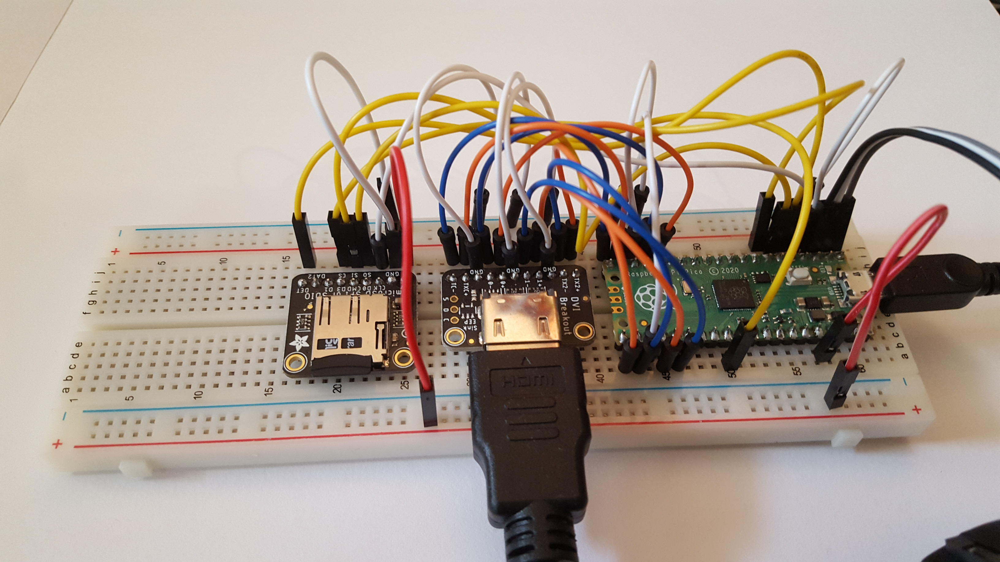
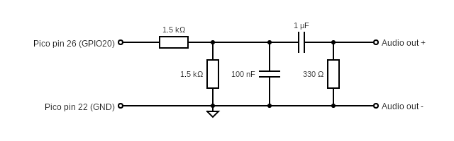

### Exidy Sorcerer 2 on breadboard with HDMI
This is a series of targets based around a breadboard prototype:

Support for the following:
* USB keyboard
* PS/2 keyboard
* USB joysticks
* 60Hz HDMI video
* HDMI/PWM audio
* SPI SD card
* Serial port debug

#### Circuit diagrams
Only GPIO 20 is used for PWM audio output.

#### Firmware
| Audio | Display mode | Firmware |
| - | - | - |
| HDMI | 640x480x60Hz | [sorcerer2_hdmi_hdmi_audio.uf2](/uf2/sorcerer2_hdmi_hdmi_audio.uf2) |
| 1 pin PWM | 640x480x60Hz | [sorcerer2_demo_dv_i2s_audio.uf2](/uf2/sorcerer2_demo_dv_i2s_audio.uf2) |

## Pi Pico Wiring table

|       | SPI0  | GPIO  | Pin   | SPI       | MicroSD 0 | HDMI/DVI  |      Description       | 
| ----- | ----  | ----- | ---   | --------  | --------- | --------- | ---------------------- |
| MISO  | RX    | 4     | 6     | DO        | DO        |           | Master In, Slave Out   |
| CS0   | CSn   | 5     | 7     | SS or CS  | CS        |           | Slave (or Chip) Select |
| SCK   | SCK   | 2     | 4     | SCLK      | CLK       |           | SPI clock              |
| MOSI  | TX    | 3     | 5     | DI        | DI        |           | Master Out, Slave In   |
| CD    |       | 22    | 29    |           | CD        |           | Card Detect            |
| GND   |       |       | 3     |           | GND       |           | Ground                 |
| 3v3   |       |       | 36    |           | 3v3       |           | 3.3 volt power         |
| GND   |       |       | 18,23 |           |           | GND       | Ground                 |
| GP16  |       | 16    | 21    |           |           | TX2+      | Data channel 2+        |
| GP17  |       | 17    | 22    |           |           | TX2-      | Data channel 2-        |
| GP18  |       | 18    | 24    |           |           | TX1+      | Data channel 1+        |
| GP19  |       | 19    | 25    |           |           | TX1-      | Data channel 1-        |
| GP12  |       | 12    | 16    |           |           | TX0+      | Data channel 0+        |
| GP13  |       | 13    | 17    |           |           | TX0-      | Data channel 0-        |
| GP14  |       | 14    | 19    |           |           | TXC+      | Clock +                |
| GP15  |       | 15    | 20    |           |           | TXC-      | Clock -                |
| GP20  |       | 20    | 26    |           |           |           | PWM audio out          |
| GP6   |       | 6     | 9     |           |           |           | PS/2 data (RP_PS2_DATA)|
| GP7   |       | 7     | 10    |           |           |           | PS/2 clk  (RP_PS2_CLK) |
