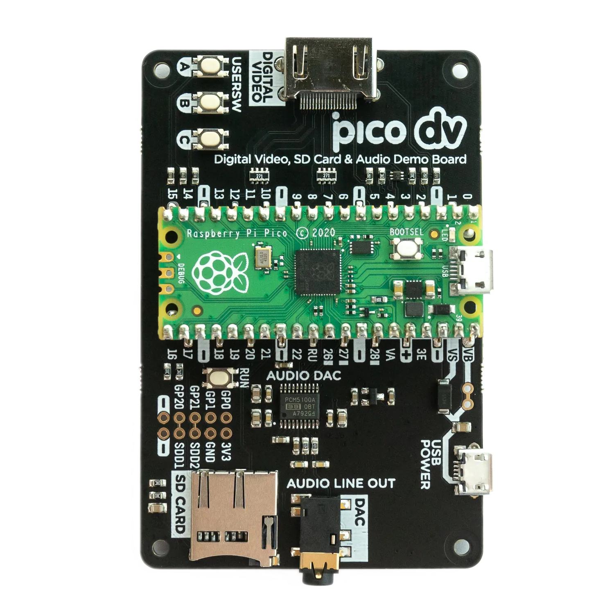
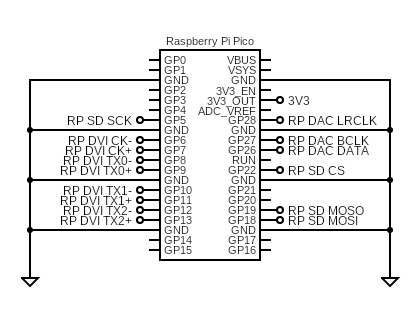

### Exidy Sorcerer 2 on Pimoroni pico dv
This target matches the [Pimoroni Pico DV](https://shop.pimoroni.com/products/pimoroni-pico-dv-demo-base) board:

It supports the following:
* USB keyboard
* USB joysticks
* HDMI video
* HDMI/I2S audio
* SPI SD card

#### Circuit diagram

#### Firmware

| Display | Audio | Firmware |
| - | - | - |
| 640x480x60Hz | HDMI | [sorcerer2_demo_dv_hdmi_audio.uf2](/uf2/sorcerer2_demo_dv_hdmi_audio.uf2) |
| 640x480x60Hz | I2S | [sorcerer2_demo_dv_i2s_audio.uf2](/uf2/sorcerer2_demo_dv_i2s_audio.uf2) |

#### Parts
[Pimoroni Pico DV](https://shop.pimoroni.com/products/pimoroni-pico-dv-demo-base)

