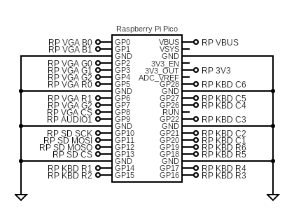

### Exidy Sorcerer 2 on Retro VGA
This is the target for Bobricius' Retro VGA board. 

It supports the following:
* USB keyboard
* USB joysticks
* VGA video (RGB332)
* PWM sound (1 pin)
* SPI SD card

Note that currenty, the on-board keys are not functional.

#### Circuit Diagram

#### Firmware

| Display mode | Firmware |
| - | - |
| 640x480x60Hz | [sorcerer2_picomputer_vga_332.uf2](/uf2/sorcerer2_picomputer_vga_332.uf2) |

