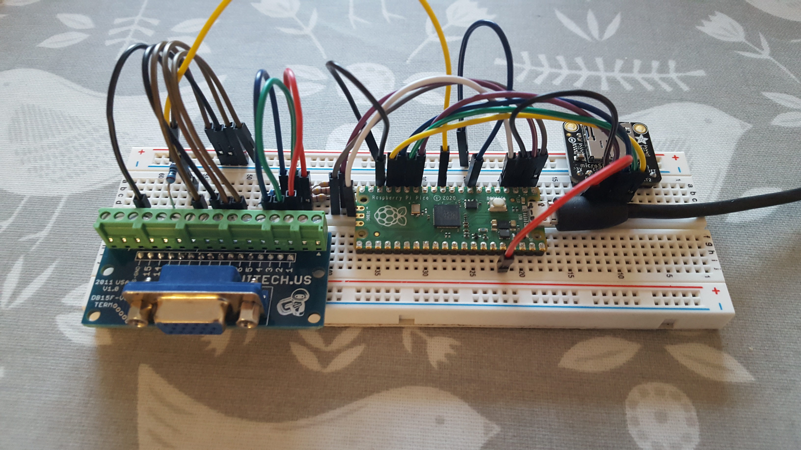
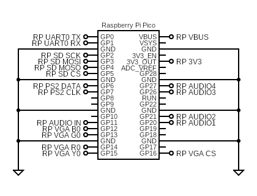
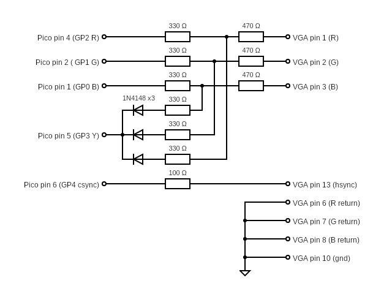

### Exidy Sorcerer 2 on breadboard with VGA
This is a target which reuses a VGA breadboard intended for a ZX Spectrum emulator. 

It supports the following:
* USB keyboard
* PS/2 keyboard
* USB joysticks
* VGA video (RGBY1111)
* PWM sound (GPIO 20)
* SPI SD card
* Serial port debug

#### Circuit diagrams
Only GPIO 20 is used for audio output.

The digram below has the wrong pin numbers, trust the picture above.

#### Firmware

| Display mode | Firmware |
| - | - |
| 640x480x60Hz | [sorcerer2_picomputer_vga_1111_ps2.uf2](/uf2/sorcerer2_picomputer_vga_1111_ps2.uf2) |